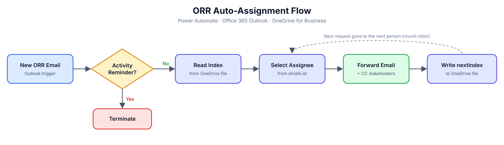

# Joshua's Portfolio  

# Project 1 :Open Records Request (ORR) Auto-Assignment Flow

**Tools:** Power Automate, Office 365 Outlook, OneDrive for Business

## Overview
At a public university, Public Information Requests have to be routed to staff quickly
and fairly, and handing them out manually was slow and uneven. I built a Power Automate
flow that assigns each new request to the next team member in a round-robin rotation.
Every request gets an owner within seconds, and the workload stays balanced.

## How It Works
1. **Trigger:** A new email arrives with the subject "PUBLIC INFORMATION REQUEST - Activity Assignment."
2. **Filter:** If the email is an "Activity Reminder," the flow stops so duplicates are never assigned.
3. **Read state:** The flow reads the current rotation index from a file stored in OneDrive.
4. **Select assignee:** Variables (`Currentindex`, `nextIndex`, `emailList`) work out which team member is next.
5. **Route:** The request is forwarded to that person with standard instructions, and key stakeholders are CC'd.
6. **Update state:** The next index goes back into the OneDrive file. When it reaches the end of the list, it starts over from the first person.

## Flow Diagram
 

## Impact
- Requests are assigned automatically instead of by hand
- Work is spread evenly across the team
- A consistent email trail supports compliance with public records timelines
- The flow saves its place between runs, so the rotation survives restarts

## Skills Demonstrated
Workflow automation, conditional logic, state management with file storage,
variable handling, and process design for compliance-driven operations.
